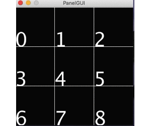

# panelGUI

シンプルなパネル型のGUIです.

パネルをクリックすることによって, 9つの処理を分岐させることができます.


## DEMO



## How To Use

処理の分岐は, パネル操作orキーボードからの入力で行います.

### パネル操作
- パネルをクリックすると, パネルの処理に応じた処理が実行されます.

- pProcess Classの中に各番号の処理を記述します.
サンプルとして, コンソールにどのボタンが押されたか表示されるようにしてあります.

### キーボード操作

- 大体vim と同じ操作方法です.

|key: |h|j|k|l|SPACE|
|:-:|:-:|:-:|:-:|:-:|:-:|
|pos : |←|↓|↑|→|center|
|panel num: |3|7|1|5|4|

- 他の数字は必要に応じて割り振ってください.

### 処理の記述場所

- Processクラスのprocedure method(下記のコード)に処理を記述します.

```java
  //ここにpanelの番号に応じた処理を記述
  //初期状態では, 押されたボタンが, コンソール上に表示されるようにしてある.
  void procedure(int op){
    if(op == 0){}
    if(op == 1){println("UP");}
    if(op == 2){}
    if(op == 3){println("LEFT");}
    if(op == 4){println("CENTER");}
    if(op == 5){println("RIGHT");}
    if(op == 6){}
    if(op == 7){println("DOWN");}
    if(op == 8){}
  }
```

### 補足
- Aruduinoなどのマイコンとシリアル通信で連携させるために作成したシンプルな移植用GUIです.
- GUIをつくりたいなら, controlP5などのライブラリを使ったほうがよい.
- リアルタイム制御には向いてないので, あくまで動作確認に用いる.
